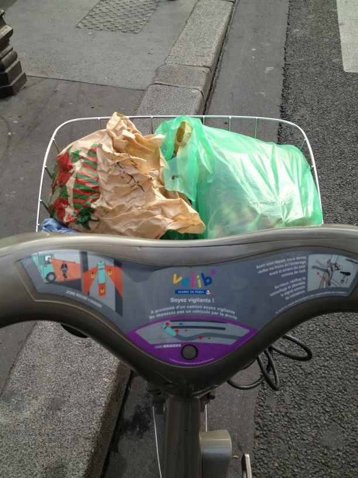
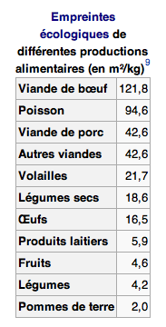
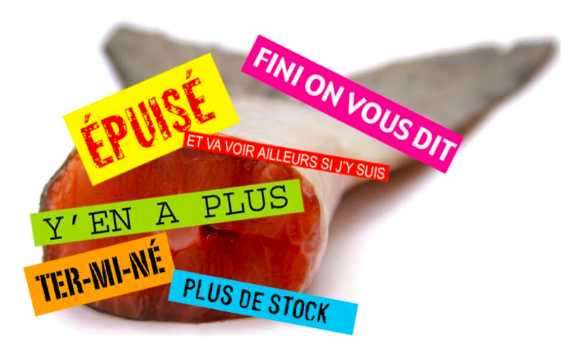

### Alimentation

#### Adhésion au [Marché sur l'eau](http://www.marchesurleau.com)

Une formidable initiative qui permet de consommer à Paris des fruits et légumes locaux transportés de manière écologique : un circuit court de quelques dizaines de kilomètres en bateau ! Je vais chercher mon panier toutes les semaines au bassin de la Villette, en vélo la plupart du temps. En plus des avantages écologiques évidents du transport ultra réduit, l'association favorise une agriculture locale (c'est important pour moi, peut-être plus que le bio) et le système de panier me permet de (re)découvrir des fruits et légumes que je ne mangeais pas forcément. Le tout pour un coup raisonnable (10€ par semaine pour deux, et quasiment aucun autre fruit et légume à acheter en complément). Vraiment un excellent système que je compte renouveler en 2013 !

#### Réduction drastique de ma consommation de viande rouge.

Après avoir longuement réfléchi sur le scandale écologique en cours et à venir de la folle consommation de viande par l'humanité, j'ai décidé d'agir à mon niveau. Je suis passé d'une consommation de viande rouge (boeuf principalement, j'en étais friand) de plusieurs fois par semaine à une fois par mois maximum. Du coup, je mange notamment beaucoup plus de poulet et oeufs, qui semblent exercer une pression bien moindre sur l'environnement. Voir le tableau ci-contre. Il se trouve que cette décision a été plutôt facile à mettre en oeuvre, ce sont de (mauvaises) habitudes de consommation qu'on change finalement très facilement.

[Source du tableau sur Wikipédia](http://fr.wikipedia.org/wiki/Impact_environnemental_de_la_production_de_viande)

#### Gare aux poissons ! 

Bien que ça ne m'arrive pas souvent, je fais maintenant très attention aux poissons que je consomme. Je me base sur les info [fournies par Greenpeace](http://www.greenpeace.org/france/PageFiles/266559/et-ta-mer-t-y-penses.pdf), avec en prime [l'application iPhone qui va avec](https://itunes.apple.com/ch/app/greenpeace-fischratgeber/id300807145?l=fr&mt=8). Lisez, ça devrait vous faire peur. En gros, on ne devrait quasiment plus rien manger parce qu'il n'y a quasiment plus rien à pêcher. Et pour quelqu'un qui a grandi en entendant Cousteau dire que les inépuisables océans représentaient le futur réservoir d'alimentation de la planète, ça fait mal au coeur… Enfin j'ai quand même de la chance, il reste trois de mes poissons préférés : sardine, maquereau et hareng.

#### Manger bio

Je faisais déjà attention à ça les années précédentes, quand c'était possible. C'est à dire qu'entre un produit bio et non bio, je choisissais le bio. En 2012, avec un gros de coup de pouce de mon entourage <3, j'ai systématisé tout ça. Je fais l'énorme majorité de mes courses chez [Biocoop](http://www.biocoop.fr) qui en plus de proposer du bio cherche aussi à favoriser les circuits et les relations durables - *sustainable* - avec les producteurs. En plus c'est à côté de chez moi, il y a du choix et c'est plutôt bon. Un petit rappel au passage, [il ne suffit pas de manger bio pour changer le monde](http://www.rue89.com/2012/07/05/conversations-avec-pierre-rabhi-rue89-publie-un-livre-numerique-233603).

<iframe width="560" height="315" src="http://www.youtube.com/embed/fYlhySf5IBk" frameborder="0" allowfullscreen></iframe>

### Mode de vie

#### Consommer naturel

Ce n'est pas seulement valable pour la bouffe bio, mais dans bien d'autres domaines importants, par exemple :

* *Se soigner avec des huiles essentielles* - là encore grosse influence de mon entourage - [c'est fou ce qu'on peut faire avec ces petites choses](http://www.amazon.fr/Bible-huiles-essentielles-Danièle-Festy/dp/2848992425/ref=sr_1_2?ie=UTF8&qid=1357219959&sr=8-2) ;

* *Produits ménagers naturels :* [vinaigre blanc, bicarbonate de soude et terre de Sommières](http://www.consoglobe.com/top-10-droguerie-ecolo-4026-cg) plutôt que produits chimiques en pagaille.
	
#### Do It Yourself et recyclage

Plutôt que d'acheter tout fait et tout neuf, récupérer, réparer et bricoler ! Je vous conseille de vous abonner à la newsletter du [site Instructables](http://www.instructables.com), il y a des idées géniales là-dedans. Je m'efforce aussi d'acheter, quand c'est nécessaire, un maximum de choses d'occasion. Exemple : un sympathique bureau sur le bon coin plutôt qu'un truc en bois collé de chez Ikea… D'ailleurs j'ai fait mon premier emménagement avec zéro Ikea inside !

#### Unclutter

A l'occasion de mon déménagement, et aussi un petit peu tous les jours, je me suis débarrassé d'un nombre considérable de choses dont je n'avais pas besoin. A la clé : un peu de sous, de la place dans son appart et dans sa tête. [Une saine lecture à ce sujet](http://www.amazon.fr/Unclutter-Your-Life-Week-ebook/dp/B002TNGBMC/ref=sr_1_1?ie=UTF8&qid=1357220346&sr=8-1), qui va même plus loin que le matériel.

#### Transports

* Augmentation des déplacements en vélo (pliable perso ou Vélib) plutôt qu'en transport en commun (zéro voiture depuis toujours).

* Un seul trajet en avion en 2012 (un de trop…). Et ce malgré un tour d'Europe d'un mois… en train ! Super expérience, à refaire dès que possible. 

> « Le vrai voyage, c’est d’y aller. Une fois arrivé, le voyage est fini. Aujourd’hui les gens commencent par la fin. » Hugo Verlomme

> « En vérité, je ne voyage pas, moi, pour atteindre un endroit précis, mais pour marcher : simple plaisir de voyager. » Robert Louis Stevenson

#### Électronique

* Tout petit geste : au moment de changer mon ordinateur portable, j'ai choisi un Macbook Air 11 pouces notamment par rapport à son empreinte carbone réduite par rapport au 13 pouces, mais surtout par au Macbook Pro Retina qui malgré son indéniable attrait esthétique et technologique est également un véritable gouffre écologique. À cause des énormes batteries nécessaires à un tel écran et du fait que le tout est difficilement démontable / recyclable : obsession de la minceur poussée toujours plus loin… Merci toutefois à Apple de rendre publiques ce genre d'informations, [exemple ici avec les Macbook Air.](http://www.apple.com/fr/macbookair/environment.html)

* Je n'ai pas acheté l'iPhone 5 :-) Je crois d'ailleurs que c'est la première année depuis l'iPhone 1er du nom que n'achète pas de nouveau smartphone. A la place, j'ai pris une extension de garantie d'un an pour mon 4S, et je compte bien le faire durer.

### Horizon 2013

* *Consolider* Toute la liste ci-dessus est à reconduire - je ne regrette rien, bien au contraire. Je vise notamment le zéro avion en 2013 !

* *Trouver une activité professionnelle en rapport* le plus direct possible avec toutes ces bonnes résolutions… Pas le moindre des challenges.

* *Plus de solidaire.* Il m'est clairement apparu que la conscience environnementale était étroitement liée à la conscience sociale et solidaire : je compte aller plus loin dans ces domaines.

* *Convaincre.* Sans connaitre exactement les moyens, je compte essayer de convaincre un maximum de gens du bien fondé de mes actions - parce que tout seul c'est bien mais ce n'est pas suffisant ! J'ai modestement commencé avec deux communautés Google+ : [Technologie solidaire et écologique](https://plus.google.com/communities/104667055874769450646) et [Co Révolution](https://plus.google.com/communities/113380020528181489648), cette dernière étant directement [inspirée du travail de SoAnn](http://www.scoop.it/t/corevolution).