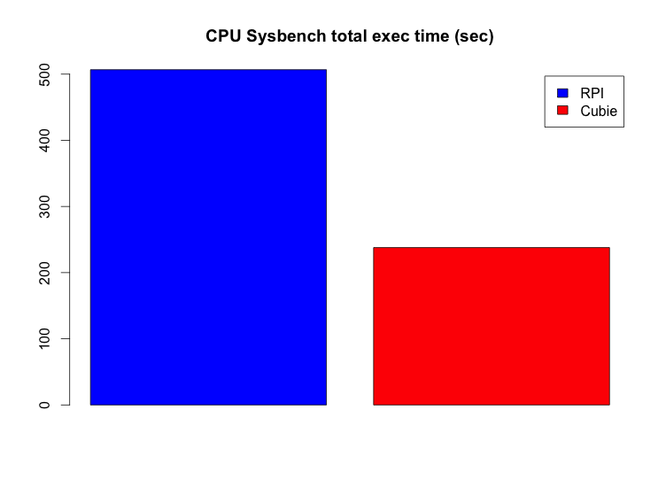
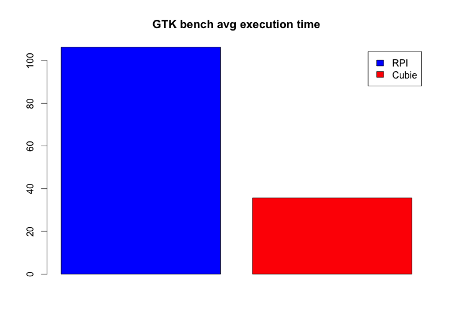

### What's a Cubie Board?

It's a small, low-priced ARM board (i.e. micro computer), aiming at delivering the most power for the price. From the [official site](http://cubieboard.org):

> * 1G ARM cortex-A8 processor, NEON, VFPv3, 256KB L2 cache
> * Mali400, OpenGL ES GPU
> * 512M/1GB DDR3 @480MHz
> * HDMI 1080p Output
> * 10/100M Ethernet
> * 4Gb Nand Flash
> * 2 USB Host, 1 micro SD slot, 1 SATA, 1 ir
> * 96 extend pin including I2C, SPI, RGB/LVDS, CSI/TS, FM-IN, ADC, CVBS, VGA, SPDIF-OUT, R-TP..
> * Running Android, Ubuntu and other Linux distributions

Price tag is 49$, you can order one on the official site. I got mine quite early by participating to the successful [IndieGoGo crowd funding campaign](http://www.indiegogo.com/cubieboard).

I got mine with the following accessories:

> * Minimalist acrylic case
> * USB to power cable
> * SATA cable
> * USB to serial cable

First impression: good enough packaging and nice accessories. Board looks sturdy except maybe for the power plug which is quite difficult to plug in and feels fragile. Someone made an unboxing video on Youtube (see below). I can confirm that the acrylic sheets protections are quite annoying to remove… But it's a one time thing.

<iframe width="560" height="315" src="http://www.youtube.com/embed/s2xGu6urECA" frameborder="0" allowfullscreen></iframe>

### Quick Raspberry Pi comparison

I'm quite a fan of the [Raspberry Pi](http://www.raspberrypi.org) (RPi), of which I own several copies. I recently received the very last model with 512MB of RAM. Let's look at the main differences between the two boards before running a quick benchmark.

#### Dimensions

Both boards are very small (remember, they are fully functionnal computers, you just need to plug-in a keyboard, mouse and screen), but the Cubie is a little larger. Below a picture with both boards, naked RPi on top and Cubie in its case on the bottom. You can see the scale by looking at the connectors on the RPi.

#### Memory

CubieBoard comes with 1 GB RAM, whereas the latest RPi comes with half as much : 512 MB. Quite a big difference here.

Also, CubieBoard comes with 4 GB NAND Flash (kind of an internal SSD drive). RPi comes with no internal Flash. Unfortunately, it seems that for the moment the internal CubieBoard Flash can not be used/filled without a Windows tool… I have to follow up on that.

Both boards have an external memory card, standard SD for RPi and micro SD for Cubie. Quite similar here.

#### Connectivity

*Network:* both boards sport an Ethernet 100M port. No wifi, but you can plug a tiny USB dongle if you need it.

*Video:* HDMI slot on both, plus a RCA out on the RPi. Never used it, probably never will, but useful if you want to plug it to a very old TV.

*Sound:* Of course HDMI can output sound, but you also get a Jack output on each board. There is also a line in on the Cubie.

*USB:* 2 ports on both boards. Cubie also has a micro USB female slot, but I don't know what it's for. Alternative power input?

*GPIO:* with both boards you can connect to the real world (e.g. with sensors) with GPIO connectivity.

*Cubie extra:* Regarding connectivity, Cubie comes with nice extra. An IR sensor (nice for remotes, especially when used as a media center) and most notably a SATA port. I think this is very nice, since it lets you plug easily and efficiently a big fat drive to your board.

#### Benchmark

I ran a few benchmarks to try to compare both board performances. I am no benchmark expert, so correct me if I've done something terribly wrong. I know that benchmarks can be easily flawed, so take the usual precautions with the results…

##### Test conditions

I used the same SD card (I have a micro SD to SD adapter) and basic [Raspbian](http://www.raspbian.org) install for both boards. This is made possible by the [excellent BerryBoot](http://www.berryterminal.com/doku.php/berryboot). I guess it's an advantage for the RPi though, since Raspbian has some RPi optimizations. I also used the same power block for both boards.

##### CPU

A few words about CPU: the RPi is powered by a ARM1176JZFS 700Mhz CPU. The Cubie sports a 1 GHz ARM cortex-A8. Presumably, the Cubie should be faster.

I used `sysbench` with the following command line:
	
	$ sysbench --test=cpu run

Judging by the total amount of time taken, on average, by the benchmark (less is better), Cubie appears twice as fast !

[Full results here, 2 tests per board.](https://gist.github.com/4501576)

##### Disk

I used `dbench` with the following command line:
	
	$ dbench 1
	

Cubie seems a little faster, but nothing too significant considering I only made 1 test per board.

[Full results here, 1 test per board.](https://gist.github.com/4501569)

##### Memory

I used `mbw` with the following command line:
	
	$ mbw 128

Unfortunately I don't really know how to interpret this (except that more is better), but the Cubie is beating hard the RPi in two categories (MCBLOCK, MEMCPY) while the last one (DUMB) is more of a tie but still with an advantage to the Cubie.

[Full results here, 2 tests per board.](https://gist.github.com/4501580)

##### GPU

I used `gtkperf` from X, with default values. 

Less is better. Once again, the Cubie is largely faster.

[Full results here, 2 tests per board.](https://gist.github.com/4501589)

### My two cents

A word on pricing: the Cubie costs 49$ and you get somewhat of a power adapter (just the USB cable without the power block), a SATA cable and 4 GB of internal memory. You can also get the case for 4$. The Pi sells for 35$ (in the US) and you do not get anything more than the raw board.

About the community: the Raspberry Pi community is *huge* and you can get some help, examples and tutorials everywhere. This is not true for the Cubie which is much more recent and is probably not suited for absolute beginners.

Overall, the benchmarks confirmed my first impression and what you could expect from the specs (and even more): the Cubie is way faster than the Pi. For example, a graphical desktop feels usable on the Cubie. I'm starting to really like this little board but I have to put it through a reality test since I only had it for one day.

